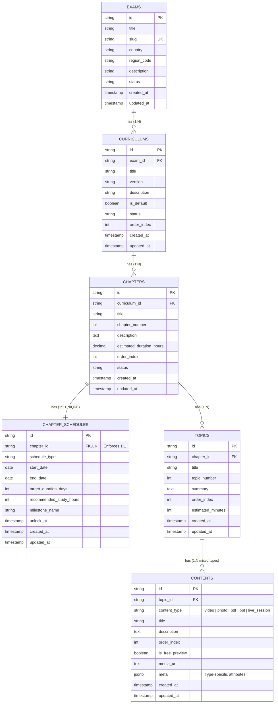

# Phase 0: Discovery & Design (Finalized Prototype Specification)
### Project: Exam → Curriculum → Chapter → Topic → Content (+ Schedule)

**Status:** Completed & Approved for Implementation  
**Target Environment:** Local Prototype (Dual-layer: SQL Relational Schema + In-Memory/Local Reactive Store)

---

## 1. Objective & Architecture Overview

The prototype replaces the legacy flat model (`Exam ──▶ Content`) with the full production-ready product structure:

```
Exam
 └── Curriculum (1:N — allows multiple tracks/versions per exam)
      └── Chapter (1:N — structured modules/weeks)
           ├── Topic (1:N — granular learning units)
           │     └── Content (1:N — mixed types: video, photo, pdf, ppt, live session)
           └── Schedule (1:1 — exactly one milestone/pacing window per chapter)
```

---

## 2. Content Types Specification & Polymorphic Schema

The `contents` entity uses a single table design with a `content_type` discriminator and a flexible `meta` JSON blob.

### 2.1 Content Types & Required Metadata Fields

| Content Type | Primary Discriminator | Required `meta` Fields | Optional / High-Yield Fields |
|---|---|---|---|
| **Video** | `'video'` | `video_url`, `duration`, `thumbnail` | `duration_seconds`, `instructor`, `chapters` (timestamps) |
| **Photo / Image** | `'photo'` | `image_url`, `caption` | `specimen_type` (e.g. ECG, Histology), `dimensions`, `aspect_ratio` |
| **PDF** | `'pdf'` | `pdf_url`, `page_count` | `file_name`, `file_size`, `author`, `download_allowed` |
| **PPT (Presentation)** | `'ppt'` | `ppt_url`, `slide_count` | `embed_url`, `file_name`, `file_size`, `presenter`, `slides` preview array |
| **Live Session** | `'live_session'` | `session_datetime`, `meeting_link`, `host_name`, `duration` | `duration_minutes`, `status` (`'scheduled'`, `'live'`, `'completed'`), `recording_url` |

---

## 3. Relational Schema Design

### 3.1 Entity Relationship (ER) Diagram



---

## 4. Resolution of Phase 0 Open Questions

### Question 1: Local DB Choice
**Decision:** **Dual-Layer Approach (Production SQL Migrations + Browser Reactive Store)**
- **Layer A (SQL DDL):** Standard, clean SQL migration files (`001_create_curriculum_hierarchy_and_schedules.sql` and `001_rollback_curriculum_hierarchy_and_schedules.sql`) compatible with PostgreSQL and SQLite. This delivers the relational schema for immediate or future backend usage.
- **Layer B (In-Memory / LocalStorage Store):** A reactive JavaScript service (`curriculumHierarchyService.js`) matching the relational schema 1-to-1, pre-seeded with rich mock data. This allows the Vite prototype to run directly in the browser with zero external DB dependencies and instant responsiveness.

### Question 2: "Live Session" Date/Time vs. Chapter Schedule
**Decision:** **Discrete & Independent Concerns**
- **Chapter Schedule** represents the *learner cohort pacing window* (e.g. *"Cardiology Module: Sept 10 – Sept 17, 14 study hours"*). It regulates milestone deadlines and unlock conditions for the entire chapter.
- **Live Session Content Item** represents an *interactive event* (e.g. *"Interactive ECG Grand Rounds at 7:30 PM IST on Thursday"*). It has its own `meta.session_datetime`, `meta.duration_minutes`, `meta.meeting_link`, and `meta.host_name`.
- **Post-Session Lifecycle:** When the live session concludes, its status updates from `scheduled` to `completed`, and its `meta.recording_url` becomes populated, allowing it to function as an on-demand video lecture for asynchronous learners.

### Question 3: Mock Data Volume & Scope
**Decision:** **2 Core Exams × 2 Curriculums × Multi-Chapter × Rich Multi-Asset Topics**
- **Exam 1:** `NEET PG & NExT 2026` (India track)
  - Curriculum A: *Core Comprehensive Clinical Curriculum (2026)*
  - Curriculum B: *Rapid High-Yield Revision Track*
- **Exam 2:** `USMLE Step 1 & 2 CK` (US track)
  - Curriculum A: *Organ-System Integrated Curriculum*
  - Curriculum B: *First-Aid Core High-Yield Modules*
- **Chapters & Schedules:** 4 chapters per curriculum with realistic date windows, study hours (12h–18h), and milestone badges.
- **Topics & Mixed Content:** 2–3 topics per chapter, each containing a realistic mix of all 5 content types (Video lecture, High-res clinical photo/ECG, PDF notes, PPT presentation deck, and Live masterclass).

### Question 4: Content-Type Specific Validation
**Decision:**
- Enforce schema-level validation on `content_type` via `CHECK (content_type IN ('video', 'photo', 'pdf', 'ppt', 'live_session'))`.
- For prototype simplicity, validate presence of `title` and `topic_id`, while leaving internal JSON `meta` fields resilient to flexible inputs.

---

## 5. Phase 0 Deliverables Checklist

- [x] Content type field list finalized (Section 2)
- [x] Local DB choice decided (Dual-layer SQL DDL + React Reactive Store)
- [x] Live Session vs. Schedule relationship decided (Independent temporal modeling)
- [x] Schema shape (single `contents` table + `meta` JSON blob) agreed & specified
- [x] Mock data volume and scope defined
- [x] ER diagram reviewed & documented
- [x] SQL migration scripts created (`001_create_curriculum_hierarchy_and_schedules.sql`)
- [x] SQL rollback script created (`001_rollback_curriculum_hierarchy_and_schedules.sql`)
